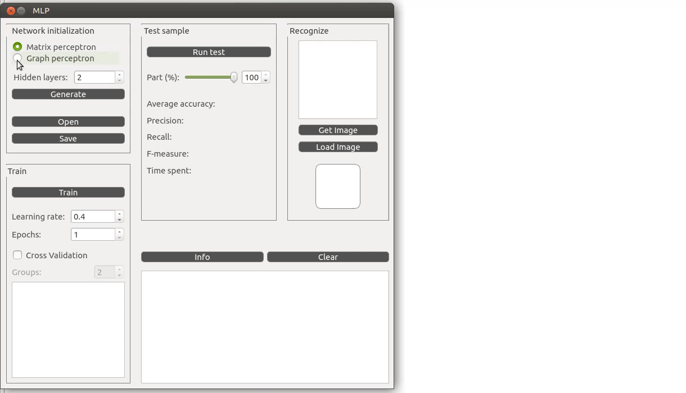
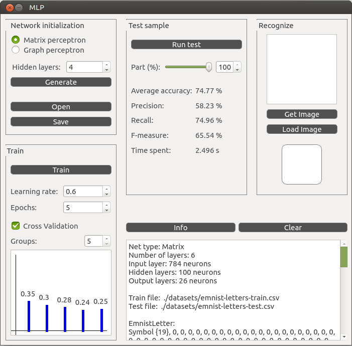

# CPP_Multilayer-Perceptron

## Проект реализации нейронной сети MLP MultiLayerPerceptron (многослойный перцептрон)

- Приложение разработано на языке C++ стандарта **C++17** с использованием компилятора g++ (GNU C++).
- Реализация графического интерфейса на основе библиотеки **QT** с API для C++17.
- Перцептрон позволяет:
  - формировать и обучать модели нейронных сетей для классификации изображения букв латинского алфавита
  - иметь от 2 до 5 скрытых слоев
  - использовать сигмоидальную функцию активации для каждого скрытого слоя
  - обучаться на открытом датасете (например, EMNIST-letters представленным в директории datasets). Тестовая выборка составляет не более 20% исходного датасета
  - показывать точность на тестовой выборке более *86 процентов*
  - производить обучение с использованием метода обратного распространения ошибки
- Перцептрон реализован двумя способами:
  - в матричной форме (все слои представлены в виде матриц весов)
  - в виде графа (каждый нейрон представляется в виде некоторого объекта узла, связанного с другими узлами ссылками)
- Перед обработкой нейронной сети входные данные нормализуются (по размеру и цвету), чтобы соответствовать формату выборки EMNIST.
- Интерфейс приложения предоставляет возможность:
  - запустить эксперимент на тестовой выборке или ее части, задаваемой дробным числом от 0 до 1 (где 0 - это пустая выборка - вырожденная ситуация, а 1 - вся тестовая выборка целиком). После выполнения эксперимента приложение выводит *средняя точность (average accuracy)*, *прецизионность (precision)*, *полнота (recall)*, *f-меру (f-measure)* и *общее затраченное время на эксперимент*
  - загружать изображения BMP (размер изображения может быть до 512х512) с латинскими буквами и классифицировать их
  - рисовать двухцветные квадратные изображения от руки в отдельном окне
  - запускать процесс обучения в реальном времени для заданного пользователем количества эпох с выводом на экран контрольных значений ошибки для каждой эпохи обучения. При этом создается отчет в виде графика изменения ошибки, рассчитанного на тестовой выборке для каждой эпохи обучения
  - запускать процесс обучения с использованием перекрестной проверки для заданного количества групп `k`
  - переключать реализацию перцептрона (матричная или графовая)
  - задавать количество скрытых слоев перцептрона (от 2 до 5)
  - сохранять в файл и загружать из файла веса перцептрона

